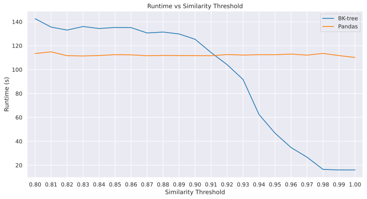
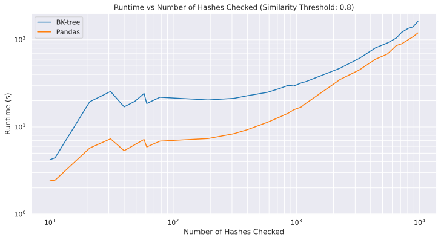

[](https://www.python.org)
[](https://github.com/pre-commit/pre-commit)
[](https://github.com/astral-sh/ruff)
[](http://mypy-lang.org/)

# Duplicate Detector - for CIR
As part of [BigData Republic](https://bigdatarepublic.nl/) Social Good Initiative, [Sam Sweere](https://github.com/SamSweere) developed this package to help the CIR team to detect & mark (possible) duplicate entries. There are two kinds of duplicates that the package can detect:
- **PDQ hash fuzzy duplicates**: These are entries with similar PDQ hashes, and are likely to be similar images.
- **URL duplicates**: These are entries that have the same URL. The url is parsed such that the parameters are removed and the url is normalized.

## PDQ Duplicate Detection
The PDQ algorithm was developed and open-sourced by Facebook (now Meta) in 2019. It is a perceptual hash function that can be used to identify similar images. For example, if an image is cropped, resized, or slightly altered, the PDQ hash will still be similar to the original image.

For open source intelligence use cases, the PDQ hash can be used to identify similar images across different sources. For example, if an image is shared on social media and in a news article, but the news article puts their watermark on the image, the PDQ hash can still be used to identify the image as the same.

While working at [BigData Republic](https://bigdatarepublic.nl/), [Emiel de Heij](https://github.com/emieldatalytica) has implemented the PDQ hash in the Bellingcat [auto-archiver](https://github.com/bellingcat/auto-archiver). From version v0.5.26 onwards, the auto-archiver has the ability to automatically generate the PDQ hashes for images and videos.

# Usage
The `detect_duplicates` function finds url and/or pdq hash duplicates in a DataFrame.

It takes the following parameters:

### Input:

1. **DataFrame (`pd.DataFrame`)**:
    - **Columns**:
        - `index` (string): A unique identifier.
        - `url` (string, optional): The original URL of the source.
        - `pdq_hash` (list of strings, optional): A list of perceptual hashes.

2. **Indices to Check (`indices_to_check`)**:
    - Type: List of strings or `None` (optional).
    - Description: Specific `index` values to check for duplicates. If `None`, all rows are checked. Duplicate annotations are always bi-directional.

3. **PDQ Hash Similarity Threshold (`pdq_hash_similarity_threshold`)**:
    - Type: Float (between 0 and 1, optional, default: 0.9). #TODO: update this
    - Description: The threshold for the Hamming distance to determine hash similarity.

4. **PDQ Duplicate Detection Method (`pdq_duplicate_detection_method`)**:
    - Type: String (optional, default: "pandas").
    - Description: The method to use for detecting PDQ hash duplicates. Options are "pandas" and "bk-tree".

### Output:

- **DataFrame (`pd.DataFrame`)**:
    - **Columns**:
        - `index` (string): A unique identifier.
        - `url_duplicates` (list of strings or `None`): Indices with duplicate URLs.
        - `pdq_hash_duplicates` (list of strings or `None`): Indices with perceptual hashes similar within the threshold.
        - `pdq_hash_similarities` (list of strings or `None`): Hash similarity scores for perceptual hashes within the threshold.

### Post-processing

When `indices_to_check` is provided, only the rows with these indices are checked. However, duplicates can be identified with indices not in this list (bi-directional). Consider this when updating the source. Note that only rows with any duplicate found will be returned.

### Example Usage
```python
from cir_duplicate_detector import detect_duplicates
duplicates_df = detect_duplicates(df, indices_to_check=None, pdq_hash_similarity_threshold=0.8)
```

## PDQ Hash Similarity Detection Approach

This package offers two strategies for identifying duplicate hashes, leveraging multi-threading to enhance performance on systems with multiple cores:
- `pandas`: Utilizing the `.apply` function, this strategy performs a straightforward one-to-one comparison of hashes by calculating the hamming distance with the `rapidfuzz` library. It proves to be the quickest and most efficient method for smaller datasets (i.e., when the `indices_to_check` parameter is minimal).
- `bk-tree`: This approach employs a BK-tree to store and search for hashes. While it is less efficient than the pandas approach for lower similarity thresholds, it is vastly more efficient for higher thresholds. When processing larger datasets, the bk-tree method's performance is comparable to that of the pandas strategy.

## Performance Comparison
This section outlines the performance of the two methods, focusing on execution speed, benchmarked on a dataset of approximately 300,000 hashes on a system equipped with 20 CPU cores. Both methods employ multi-threading to optimize utilization of available computational resources.

### Runtime vs Similarity Threshold


The comparison indicates that, for a similarity threshold up to 0.91, the BK-tree method operates at a slower pace compared to the pandas method. Beyond this threshold, however, the BK-tree method demonstrates a notable increase in speed over the pandas method. This performance inversion is due to the BK-tree's complexity in managing hashes with a greater number of allowable bits, requiring extensive traversal to locate hashes matching the query. In contrast, the pandas method does not face such traversal overhead, maintaining a consistent speed advantage under these conditions.

Given that the optimal threshold for identifying fuzzy duplicates tends to be more towards 0.8, the pandas method is recommended for most scenarios and thus is the default choice.

### Runtime vs Number of Hashes Checked



Here, the BK-tree method's performance is observed to lag behind that of the pandas method at a similarity threshold of 0.8. This performance gap widens as the number of hashes to be checked decreases. This outcome stems from the necessity for the BK-tree method to construct the tree structure before initiating the search process. The pandas method is more efficient, especially for smaller datasets, because it doesn't require this initial setup.

## Development Installation
Make sure to have Python 3.11 installed and create a virtual environment.

Install the requirements by using:
```bash
pip install -r requirements.txt
```

### Detailed Development Installation
The following steps are for a detailed installation of the development environment. Note that for every step there are multiple ways to i.e. install python, create an environment or install dependencies. The following steps are just one way to do it.


1. Install `Pyenv`:
    https://github.com/pyenv/pyenv#installation
2. Install `python 3.11.8`:
    ```bash
    pyenv install 3.11.8
    ```
3. Install pyenv-virtualenv:
    https://github.com/pyenv/pyenv-virtualenv

4. Create a virtual environment:
    ```bash
    pyenv virtualenv 3.11.8 cir_duplicate_detector
    ```
5. Enable and use the virtual environment:
    ```bash
    pyenv local cir_duplicate_detector
    pyenv activate cir_duplicate_detector
    ```
6. Install poetry:
    ```bash
    pip install poetry
    ```
7. Install the dependencies:
    ```bash
    poetry install
    ```

# Contributors
- [Sam Sweere](https://github.com/SamSweere): Code implementation, testing, documentation, and more.
- [Emiel de Heij](https://github.com/emieldatalytica): Project initiation, PDQ hash implementation in the Bellingcat [auto-archiver](https://github.com/bellingcat/auto-archiver).
